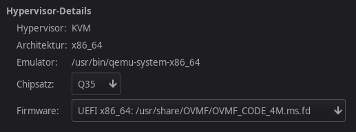

# bitpixie Proof of Concept

**Information:** This repository is still under development and does not yet work!

- [x] BCD-Creator
- [x] Linux Secure Boot
- [ ] Linux Exploit / VMK Scanner
- [ ] Complete Guided Exploit Script

## General concept of the attack

The Bitpixie bug was originally discovered by [Rairii](https://github.com/Wack0) and assigned CVE-2023-21563.
The first public demonstration of the full attack was performed by th0mas at 38c3: ["Windows BitLocker: Screwed without a Screwdriver"](https://media.ccc.de/v/38c3-windows-bitlocker-screwed-without-a-screwdriver).
Large parts of this repository are based on his work.

## Prerequisites
In order to carry out this attack, the encrypted computer must meet certain requirements.
- It must use Bitlocker without pre-boot authentication.
- It must be able to boot in PXE mode. Ideally, the PXE boot option is not disabled in the bios. On some systems, this attack may work even if PXE boot is disabled, as PXE boot can be enabled by connecting an external network card.

### Software requirements for the attacker machine
The following packages have to be installed on the attacker machine:
- dnsmasq
- impacket-smbserver

## How to perform the attack
The attack consists of two separate steps.
First, a modified BCD configuration file must be created specifically for the victim.
The next step is to boot the target via PXE using the modified BCD file, so that the VMK can be extracted from memory.

## How to set up a test environment
### Setting up QEMU
This exploit can be tested using QEMU.

I installed Windows 11 ([Tiny 11](https://github.com/ntdevlabs/tiny11builder)) on a newly created disk, installed all security patches and activated Bitlocker.
Before creating the virtual machine, I had to edit the loader and change it to `/usr/share/OVMF/OVMF_CODE_4M.ms.fd` as shown below.

After enabling Bitlocker, change the model type of the network interface to `virtio`.

### Building the initrd
All files for building the initrd can be found in the Linux-Exploit folder.
